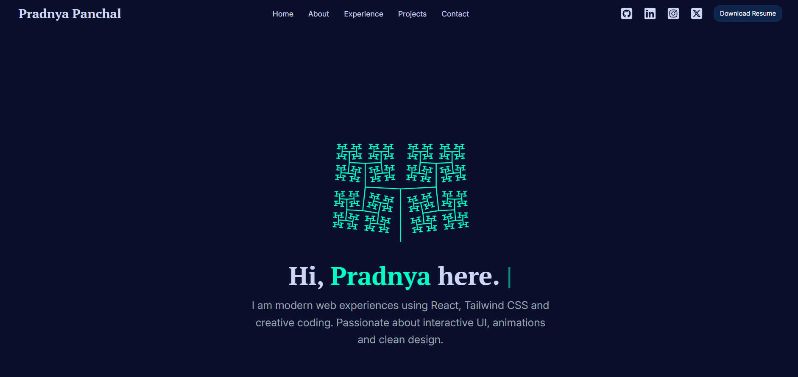

<p align="center">
  
</p>
<h1 align="center">
  pradnyapanchal.com - v1
</h1>
<p align="center">
  The first iteration of <a href="https://gazijarin.com" target="_blank">pradnyapanchal.com</a> built with React.js leveraging Material UI.
</p>



## 🛠 set-up

1. Install the dependencies

   ```sh
   npm install 
   ```

2. Start the development server

   ```sh
   npm run start
   ```

## 🚀 build and run for production

1. Generate a full static production build

   ```sh
   npm run build
   ```

